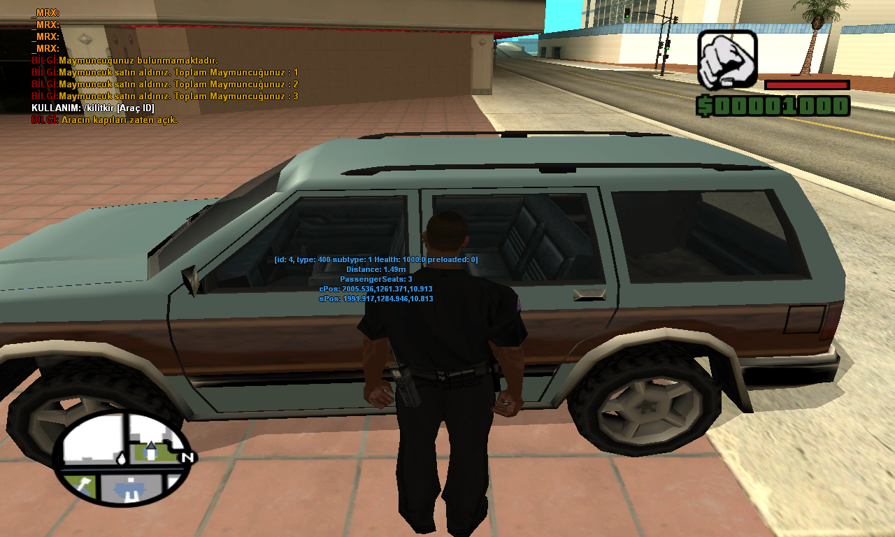
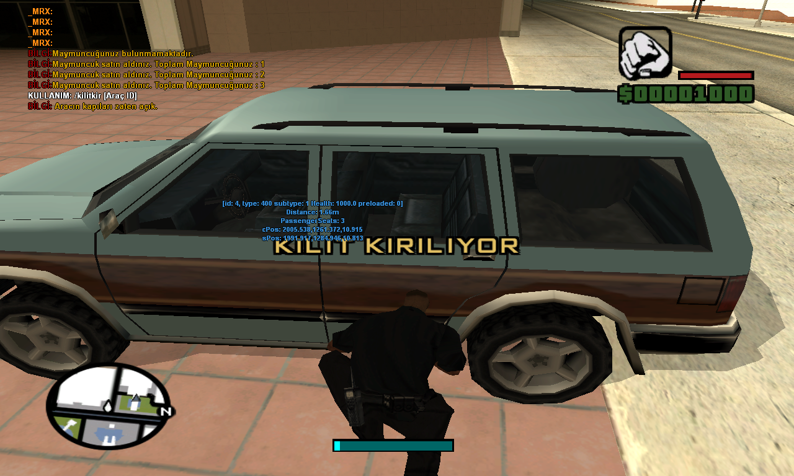
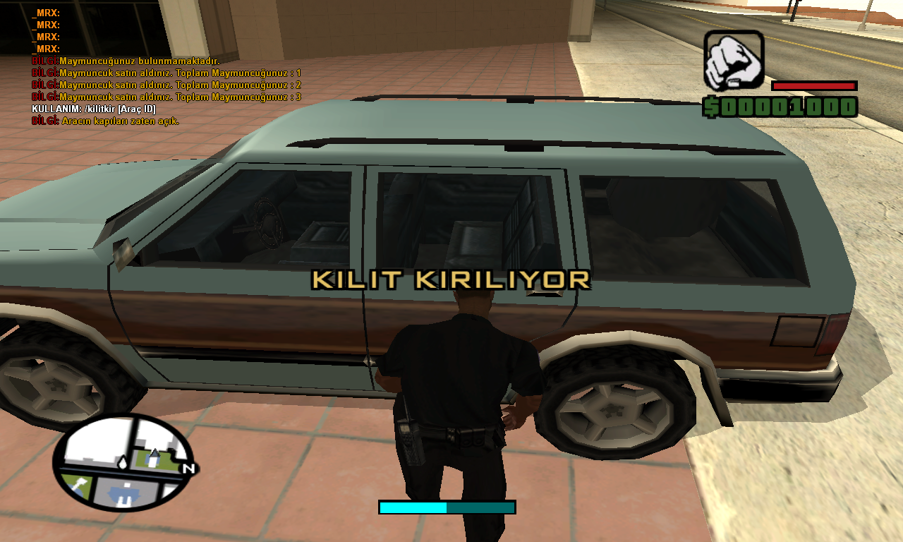
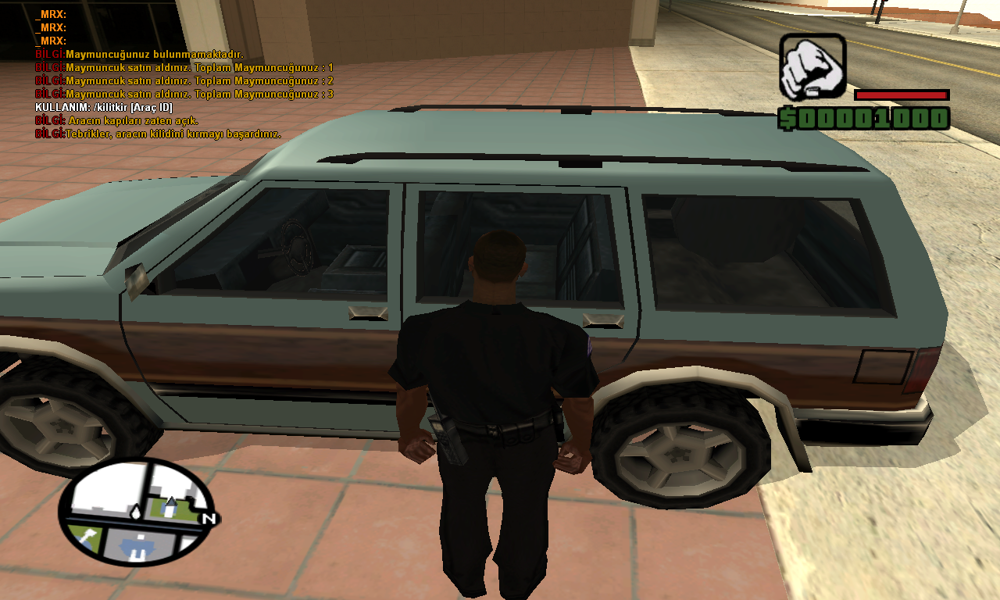

## Maymuncuk Sistemi

Yayınlanma Tarihi: 11.01.2017

Version: V1

 ([GtaMulti konu linki](https://www.gtamulti.com/forum/mod-galerisi/maymuncuk-sistemi/msg23454/#msg23454))

# Komutlar

- ```/maymuncukal``` Maymuncuk satın almak için kullanılır.
- ```/kilitkir [Araç ID]``` Girdiğiniz Araç ID numarasının kilidini kırmak için kullanılır.Aracın yakınında olmalısınız.
- ```/kilitle``` Bindiğiniz aracı kilitlemeniz için konulmuştur. (Test için)
- ```/kilitac``` Bindiğiniz aracın kilidini açmak için kullanılır.

# Ekran Görüntüleri




